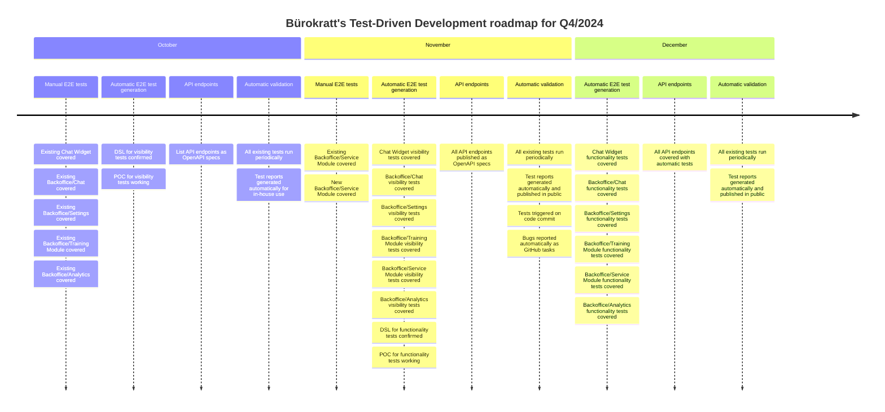

# Bürokratt's Test-Driven Development roadmap

- **Author:** Rainer Türner
- **Date:** 10.10.2024
- **Version:** 1.0.0
- **Status:** Draft
- **Last Updated:** N/A
- **Reviewed By:** Markko Liutkevicius
- **Approvers:** Rainer Türner, Markko Liutkevicius

---

## Change Log
| Version | Date       | Author     | Description                           |
|---------|------------|------------|---------------------------------------|
| 1.0.0   | 2025-10-10 | Rainer Türner     | Initial document creation             |

